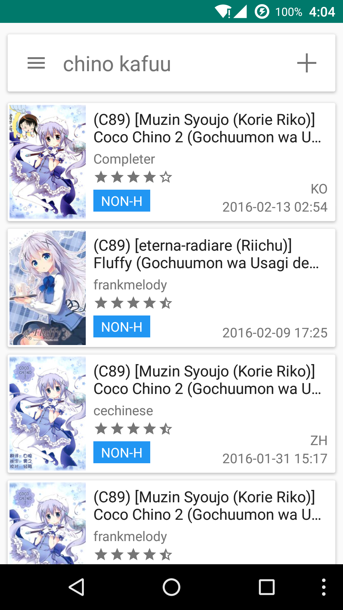

# AnotherViewer

一个 E-Hentai Android 平台的浏览器，基于 [AnotherViewer](https://github.com/seven332/AnotherViewer) 及其衍生项目。

An E-Hentai Application for Android, based on [AnotherViewer](https://github.com/seven332/AnotherViewer) and its derivatives.

本仓库同时包含 **Android 客户端**与**本地 Web App（局域网服务器）**，两者可以协同工作：收藏/历史同步、远程阅读、委托下载。

This repository contains both the **Android client** and a **local Web App (LAN server)**. The two work together: favorites/history sync, remote reading, and delegated downloads.

### [常见问题汇总 / FAQ](FAQ.md)

主要改动包括如下：
* samba支持：用户可以将自己的缓存库同步/指向本地samba服务器，对于小容量设备更友好
* 横屏双页：针对折叠屏、平板电脑用户，横屏观看可以同时观看两页内容（具体兼容性视内容尺寸而定），更像实体书籍

Main improvements are as follows:
* Samba support: You can now mount & sync your local downloads to a samba server, making it more friendly for devices with limited storage.
* Dual-page landscape mode: On foldables and tablets, landscape viewing displays two pages side by side (compatibility depends on content dimensions), more like reading a physical book. 

## Screenshot



## Build

Windows

    > git clone https://github.com/PegionFish/AnotherViewer.git
    > cd AnotherViewer
    > gradlew app:assembleDebug

Linux

    $ git clone https://github.com/PegionFish/AnotherViewer.git
    $ cd AnotherViewer
    $ ./gradlew app:assembleDebug

生成的 apk 文件在 `app/build/outputs/apk` 目录下

The apk is in `app/build/outputs/apk`

Web App（后端 + 前端）的构建与启动方式见下方 [Web App](#web-app) 一节。
To build and run the Web App (backend + frontend), see the [Web App](#web-app) section below.

## Web App

将 Android 客户端转换为局域网内任意设备可通过浏览器访问的 Web App。

### 功能

- 浏览、搜索 E-Hentai 画廊
- 图片阅读器（翻页/滚动/缩放/手势/键盘）
- 下载管理（多级并发、实时进度）
- 收藏管理（10 个收藏夹）
- 评论功能
- 浏览历史
- SMB 备份
- 设置管理
- Android 协同：收藏/历史同步、远程阅读、委托下载（Android 端在"服务器同步"设置中配置）

### 快速开始

```bash
# 构建
./build.sh

# 启动（Docker）
docker compose up -d

# 或启动（裸机）
./start.sh

# 访问
open http://localhost:8080
```

详见 [Web App 部署指南](docs/deployment.md)

### 安全与运维（WebUI）

#### 认证（默认关闭）

默认 `security.require_auth = false`：所有 API（含备份导出/还原、同步）**匿名可访问**。
请只在**可信网络**（家庭/办公 LAN）部署；若需暴露到不可信网络或公网，必须先设置
`ANOTHERVIEWER_REQUIRE_AUTH=true` 并配置账号（配对流程不受影响，仍可正常配对），
再叠加 HTTPS 反代与访问来源限制。不要用默认配置直接暴露公网。

#### 跨域（CORS）配置

默认 CORS 白名单为 `http://localhost:*,http://127.0.0.1:*`（本机回环，任意端口），
**不再默认放行任意 origin**。WebUI 前端与 API **同源部署**（Spring 直接托管前端静态
资源；开发态 Vite 也经 `/api`、`/ws` 代理到后端），因此收紧默认值对默认部署**无影响**。
仅当把前端托管在其它 origin 时才需要配置（逗号分隔）：

```bash
ANOTHERVIEWER_CORS_ORIGINS=https://reader.example.com
ANOTHERVIEWER_CORS_ORIGINS=http://192.168.1.10:3000,http://192.168.1.11:3000
```

显式配置 `*`（可信内网）仍被透传支持；`allowCredentials=true` 下浏览器不接受
`*` + 凭据的组合，请尽量用具体 origin。

#### 安全响应头

应用层（Spring Security）为所有响应统一注入：`X-Frame-Options: DENY`、
`X-Content-Type-Options: nosniff`、`Content-Security-Policy`，以及**仅 HTTPS 请求生效**
的 `Strict-Transport-Security`（`request.isSecure()` 时才写入）。Caddy 反代部署
（`deploy/Caddyfile`）会再加一层**同值**头，两层一致不冲突；无反代（Docker/systemd
直接暴露）时由应用层兜底。

CSP 取舍（宽松但非空）：SPA 用内联样式与 `blob:` 图源，故 `style-src` 含
`'unsafe-inline'`、`img-src` 含 `data: blob:`、`connect-src` 放行同源 WebSocket
（`ws: wss:`）；未启用 `'unsafe-eval'`。若升级后前端出现样式/图像/WS 被拦截的异常，
属此改动需要复核的点，请反馈。另注意：Caddy 终结 TLS 时 Spring 看到的是内联 HTTP，
应用层 HSTS 不会写入——完整 HTTPS 部署如需 HSTS，请在反代层头中追加。

#### Docker 卷与运行用户（非 root）

镜像内 java 进程以 `appuser`（**UID 1000**）运行（M-12）：容器启动时短暂以 root
修正 `/app/data`、`/app/cache`、`/app/downloads` 三个挂载卷的属主后降权执行
（见 Dockerfile ENTRYPOINT）。`docker compose up -d` 一般无需额外操作；若自定义
bind mount 目录报权限错误，宿主机执行 `sudo chown -R 1000:1000 <挂载目录>`。
验证进程非 root：`docker exec anotherviewer-web ps -o user,pid,cmd`。

#### 数据库 schema 变更约定

本项目**不引入** Flyway/Liquibase（C-2 评估结论：单用户 SQLite 自托管收益有限），
schema 由 Hibernate `ddl-auto: update` 自动演进。因此**改 schema 必须人工验证**：

1. **先备份**：`cp data/anotherviewer.db data/anotherviewer.db.bak`（或用管理界面备份）；
2. 升级后核对启动日志中的 Hibernate DDL 与数据完整性（收藏/历史/下载/设置）；
3. `update` 只加列/加表，**不删列、不改类型**；破坏性变更需人工 SQL 或重建库
   （会丢数据，务必先备份）；
4. 大版本升级先在测试环境验证，再动生产库。

## Acknowledgments

本项目是 [AnotherViewer](https://github.com/seven332/AnotherViewer) 的 Fork 的 Fork：AnotherViewer → [Anotherviewer_CN_SXJ](https://github.com/xiaojieonly/Anotherviewer_CN_SXJ) → AnotherViewer。

- 感谢 AnotherViewer 奠基人 [Hippo/seven332](https://github.com/seven332)
- 感谢 [xiaojieonly](https://github.com/xiaojieonly) 维护的 [Anotherviewer_CN_SXJ](https://github.com/xiaojieonly/Anotherviewer_CN_SXJ) 中文分支，本项目基于其代码继续开发

This project is a fork of a fork of [AnotherViewer](https://github.com/seven332/AnotherViewer): AnotherViewer → [Anotherviewer_CN_SXJ](https://github.com/xiaojieonly/Anotherviewer_CN_SXJ) → AnotherViewer.

- Thanks to [Hippo/seven332](https://github.com/seven332), the founder of AnotherViewer
- Thanks to [xiaojieonly](https://github.com/xiaojieonly) for maintaining [Anotherviewer_CN_SXJ](https://github.com/xiaojieonly/Anotherviewer_CN_SXJ), the Chinese fork this project is based on

本项目受到了诸多开源项目的帮助
This project has received help from many open source projects

- [AOSP](http://source.android.com/)
- [android-advancedrecyclerview](https://github.com/h6ah4i/android-advancedrecyclerview)
- [Apache Commons Lang](https://commons.apache.org/proper/commons-lang/)
- [apng](http://apng.sourceforge.net/)
- [giflib](http://giflib.sourceforge.net)
- [greenDAO](https://github.com/greenrobot/greenDAO)
- [jsoup](https://github.com/jhy/jsoup)
- [libjpeg-turbo](http://libjpeg-turbo.virtualgl.org/)
- [libpng](http://www.libpng.org/pub/png/libpng.html)
- [okhttp](https://github.com/square/okhttp)
- [roaster](https://github.com/forge/roaster)
- [ShowcaseView](https://github.com/amlcurran/ShowcaseView)
- [Slabo](https://github.com/TiroTypeworks/Slabo)
- [TagSoup](http://home.ccil.org/~cowan/tagsoup/)

## License

    Copyright 2014-2016 Hippo Seven
    Copyright 2020-2026 xiaojieonly

    Licensed under the Apache License, Version 2.0 (the "License");
    you may not use this file except in compliance with the License.
    You may obtain a copy of the License at

        http://www.apache.org/licenses/LICENSE-2.0

    Unless required by applicable law or agreed to in writing, software
    distributed under the License is distributed on an "AS IS" BASIS,
    WITHOUT WARRANTIES OR CONDITIONS OF ANY KIND, either express or implied.
    See the License for the specific language governing permissions and
    limitations under the License.
